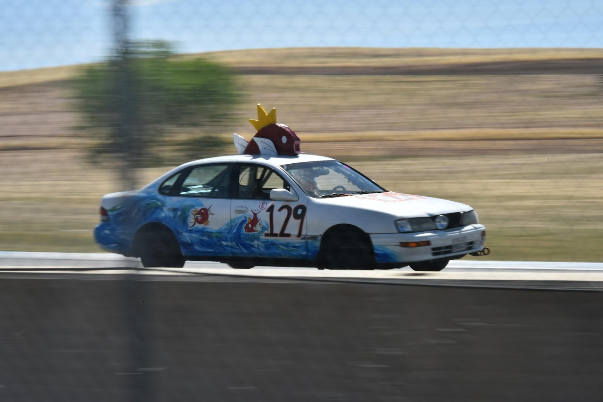

  

    
  

The car cookin it down the back straight

# Who we are and why are we making this film?
We're a group of romantics, trying to answer:
*What happens as we dance across the line with someone we still care about?*

We have a hypothesis that *liminal spaces* are uniquely positioned to create and faciliate this.

We are inspired by films like *Chunking Express, Hotel Chavelier, Yi YI*.

# What are we looking for?
The film will feature two former lovers:

An actress for:
Katherine:
- mid twenties
- art gallery host
- daring, naive, humble

An actor for:
Mark:
- mid twenties
- painter
- dreamer, yearning for something

Someone with expreience with:
Audio:
- Knows how to setup-for and execute re-recorded audio
- Record in loud environments like the BART

People who are excited to help in any other capacity!

# If you're interested...
TODO