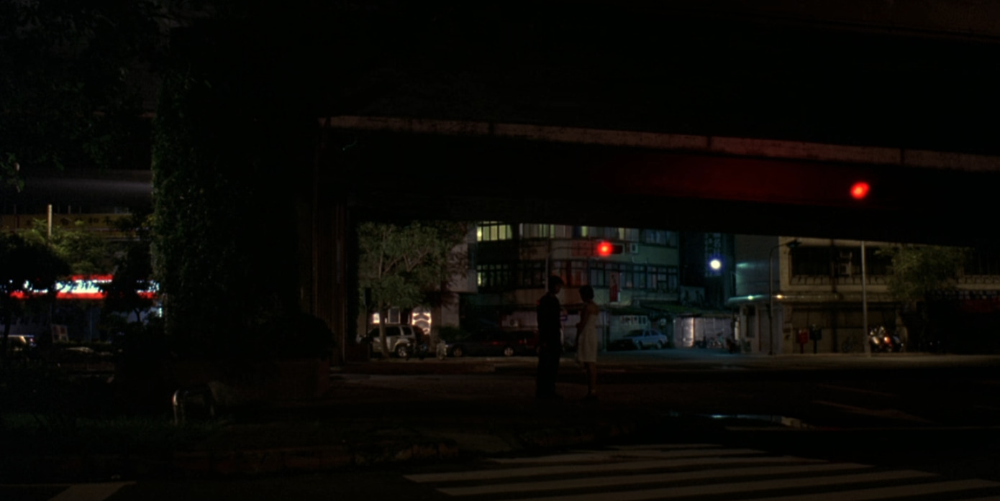
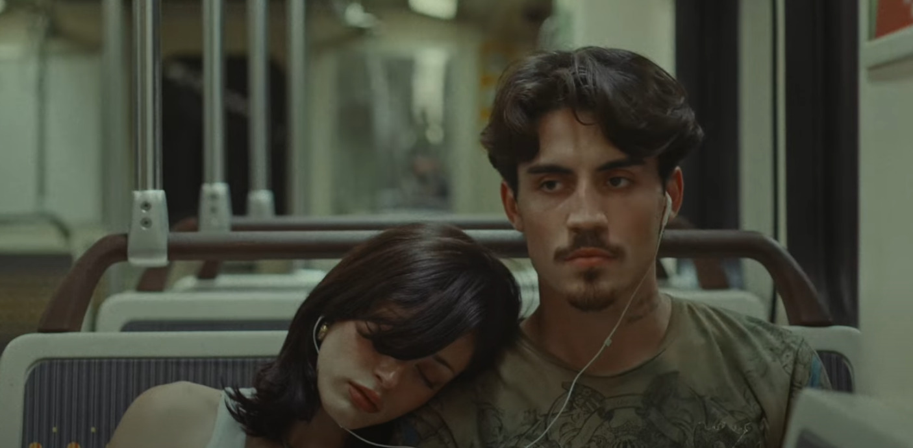
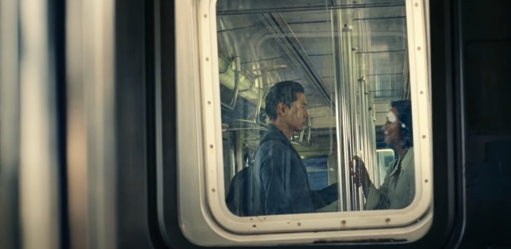

  

    
  

A shot from Yi Yi that we love -- intimate emotions from paralyzingly far.

## Until Rockridge
Two former lovers reunite by chance on a train ride home and break a long silence between them. As the world rushes past, they revisit the unspoken, caught between holding on and letting go. This is a story of the orbits we navigate with the ones we still love.

## Who we are and why are we making this film?
- We're a group of romantics, trying to have fun!
- We want to figure out what happens in *liminal spaces*
- We are inspired by the emotions from films like *Chunking Express, Hotel Chavelier, Yi YI*.

# What are we looking for?
An actress for *Katherine*:
- mid twenties
- art gallery host
- daring, naive, humble

An actor for *Mark*:
- mid twenties
- painter
- dreamer, yearning for something

Someone with expreience with *Audio*:
- knows how to setup-for and execute re-recorded audio
- record in loud environments like the BART

People who are excited to help in any other capacity!

---

Oh and by the way! here are some more shots that inspire us:

  

    
  

  

    
  

  
Language of Memory - Devin Desouza

  
Past Lives - Celine Song

# Joining the team:
### If you are interested in acting...
Please read aloud and record both the example male and female lines here.
Feel free to add whatever interpretations of the tone or deviations of the lines as you see fit!

<strong>Katherine:</strong> 
What are we doing?

<strong>Mark:</strong> 
I was trying to be friends again.

<strong>Katherine:</strong> 
Were we ever friends?

<strong>Mark:</strong> 
(small exhale) I’m sorry.

<strong>Katherine:</strong> 
We both know we can’t do this again. (beat) Why did you come along tonight?

<strong>Mark:</strong> 
I thought… maybe I owed you something.

<strong>Katherine:</strong> 
Like what?

<strong>Mark:</strong> 
An apology.

---

Please submit your mini-audition for acting on this [google form application](https://forms.gle/wjnqGLDM65fk8ZnK8)!

If you are intersted sound engineering or production staff, **please fill out the same form as above**.

# Questions??
Please reach out directly to shihaocao@gmail.com, kaiyokoo@gmail.com, or nedgarjohn@ucla.edu! Or text us! Or dm on instagram!